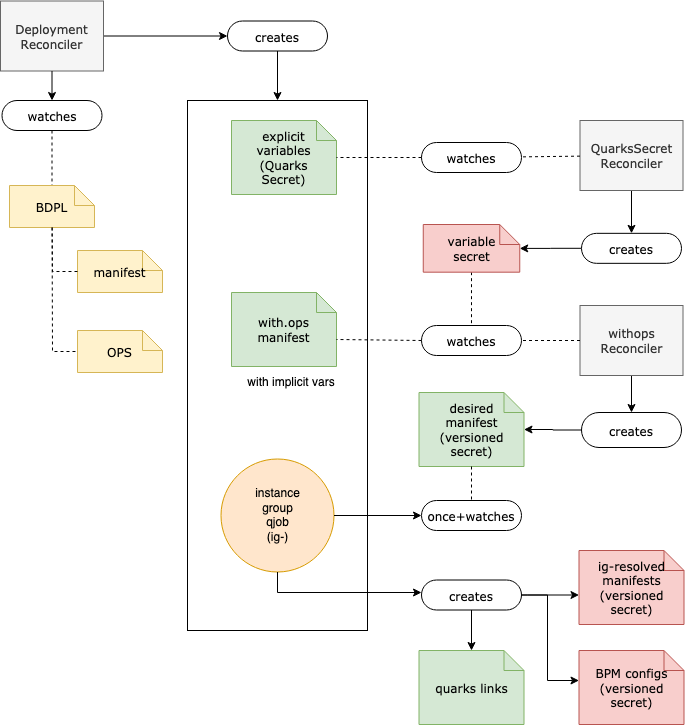

The `quarks-operator` watches four different types of custom resources:

* [BoshDeployment](bosh_deployment)
* [QuarksJob](../../../quarks-job/development)
* [QuarksSecret](../../../quarks-secret/development)
* [QuarksStatefulSet](../../../quarks-statefulset/development)

The `quarks-operator` requires the according CRDs to be installed in the cluster in order to work as expected. By default, the `quarks-operator` applies CRDs in your cluster automatically.

To verify that the CRD´s are installed:

```bash
$ kubectl get crds
NAME                                            CREATED AT
boshdeployments.quarks.cloudfoundry.org        2019-06-25T07:08:37Z
quarksjobs.quarks.cloudfoundry.org           2019-06-25T07:08:37Z
quarkssecrets.quarks.cloudfoundry.org        2019-06-25T07:08:37Z
quarksstatefulsets.quarks.cloudfoundry.org   2019-06-25T07:08:37Z
```

### Architecture design



(Source: https://drive.google.com/file/d/1Uk2h5pOmY-gLtbfpDNO3POTcqI5UdZgj/view?usp=sharing)

