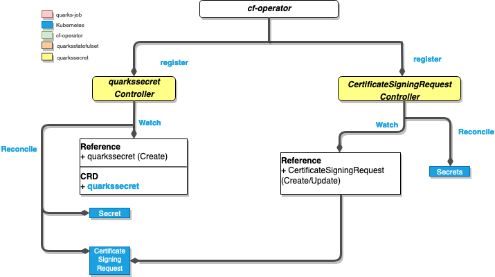
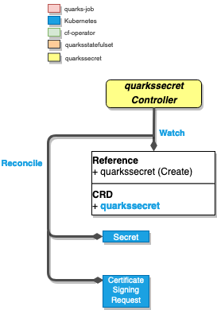
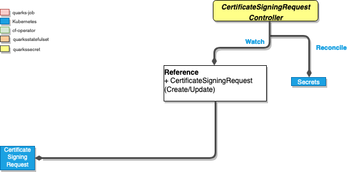

## Description

Quarks Secret generates passwords, keys and certificates and stores them in Kubernetes secrets.

## Quarks Secret Component

The **Quarks Secret** component consists of three controllers, each with a separate reconciliation loop.

Figure 1, illustrates the component and associated set of controllers.


*Fig. 1: The Quarks Secret component*

### **_Quarks Secret Controller_**


*Fig. 2: The Quarks Secret controller*


#### Watches in Quarks Secret Controller

- `QuarksSecret`: Creation
- `QuarksSecret`: Updates if `.status.generated` is false

#### Reconciliation in Quarks Secret Controller

- generates Kubernetes secret of specific types(see Types under Highlights).
- generate a Certificate Signing Request against the cluster API.
- sets `.status.generated` to `true`, to avoid re-generation and allow secret rotation.

#### Highlights in Quarks Secret Controller

##### Types

Depending on the `spec.type`, Quarks Secret supports generating the following:

| Secret Type                     | spec.type     | certificate.signerType | certificate.isCA |
| ------------------------------- | ------------- | ---------------------- | ---------------- |
| passwords                       | `password`    | not set                | not set          |
| username-password pairs         | `basic-auth`  | not set                | not set          |
| rsa keys                        | `rsa`         | not set                | not set          |
| ssh keys                        | `ssh`         | not set                | not set          |
| self-signed root certificates   | `certificate` | `local`                | `true`           |
| self-signed certificates        | `certificate` | `local`                | `false`          |
| cluster-signed certificates     | `certificate` | `cluster`              | `false`          |
| k8s TLS (`kubernetes.io/tls`)   | `tls`         | `local`                | `false`          |

> **Note:**
>
> You can find more details in the [BOSH docs](https://bosh.io/docs/variable-types).

##### Auto-approving Certificates

A certificate `QuarksSecret` resource can be signed by the Kubernetes API Server. The **Quarks Secret** Controller is responsible for generating the certificate signing request:

```yaml
apiVersion: certificates.k8s.io/v1beta1
kind: CertificateSigningRequest
metadata:
  name: generate-certificate
spec:
  request: ((encoded-cert-signing-request))
  usages:
  - digital signature
  - key encipherment
```

#### Copy Controller

#### Watches in CSR Controller

- `User Defined Secret`: Updation
- `QuarksSecret`: Updates if `.status.copied` is false

#### Reconciliation in Copy Controller

- create/updates copies of generated `secret` or a user created `secret` across multiple namespaces, as long as there are a empty `secret` or `QuarksSecret` with type `copy` in the target namespaces.
- validates `secret` or `QuarksSecret` in the target namespace by checking the following annotation

```text
quarks.cloudfoundry.org/secret-copy-of: NAMESPACE/SOURCE_QUARKS_SECRET_NAME
```

- Copied `Secrets` do not have an owner set, and are not cleaned up automatically when the `QuarksSecret` is deleted.

### **_CertificateSigningRequest Controller_**


*Fig. 3: The CertificateSigningRequest controller*

#### Watches in CSR Controller

- `Certificate Signing Request`: Creation

#### Reconciliation in CSR Controller

- once the request is approved by Kubernetes API, will generate a certificate stored in a Kubernetes secret, that is recognized by the cluster.

#### Highlights in CSR Controller

The CertificateSigningRequest controller watches for `CertificateSigningRequest` and approves `QuarksSecret`-owned CSRs and persists the generated certificate.

### **_SecretRotation Controller_**

The secret rotation controller watches for a rotation config map and re-generates all the listed `QuarksSecrets`.

#### Watches in Secret Rotation Controller

- `ConfigMap`: Creation of a config map, which has the `secret-rotation` label.

#### Reconciliation in Secret Rotation Controller

- Will read the array of `QuarksSecret` names from the JSON under the config map key `secrets`.
- Skip `QuarksSecret` where `.status.generated` is set and `false`
- Set `.status.generated` for each named `QuarksSecret` to `false`, to trigger re-creation of the corresponding secret.

## Relationship With the BDPL Component

All explicit variables of a BOSH manifest will be created as `QuarksSecret` instances, which will trigger the **Quarks Secret** Controller.
This will create corresponding secrets. If the user decides to change a secret, the `.status.generated` field in the corresponding `QuarksSecret` should be set to `false`, to protect against overwriting.

## Examples

See https://github.com/cloudfoundry-incubator/quarks-secret/tree/master/docs/examples
